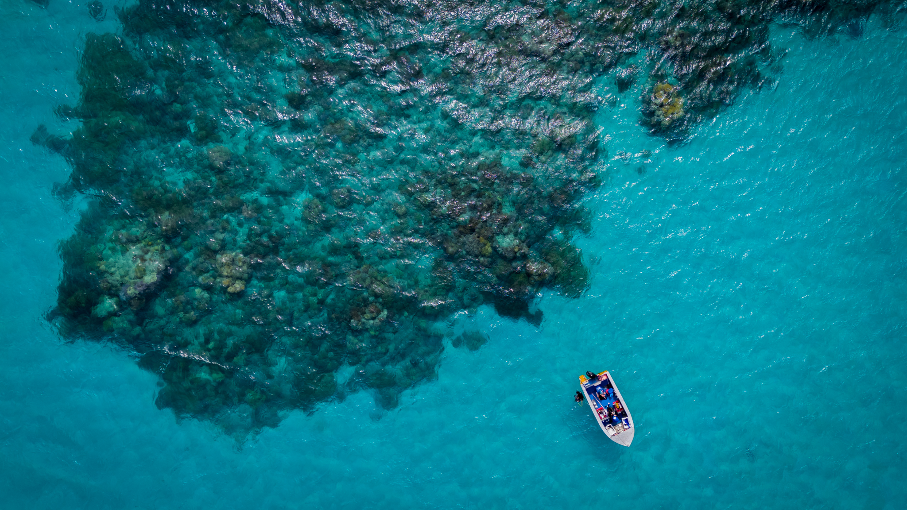
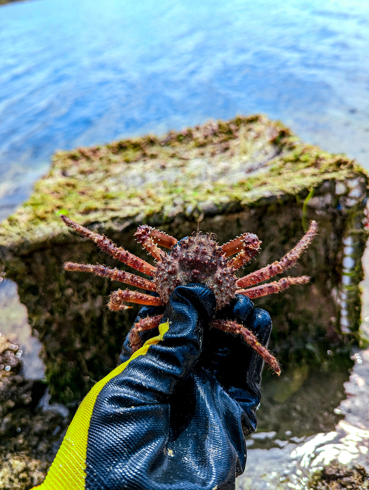
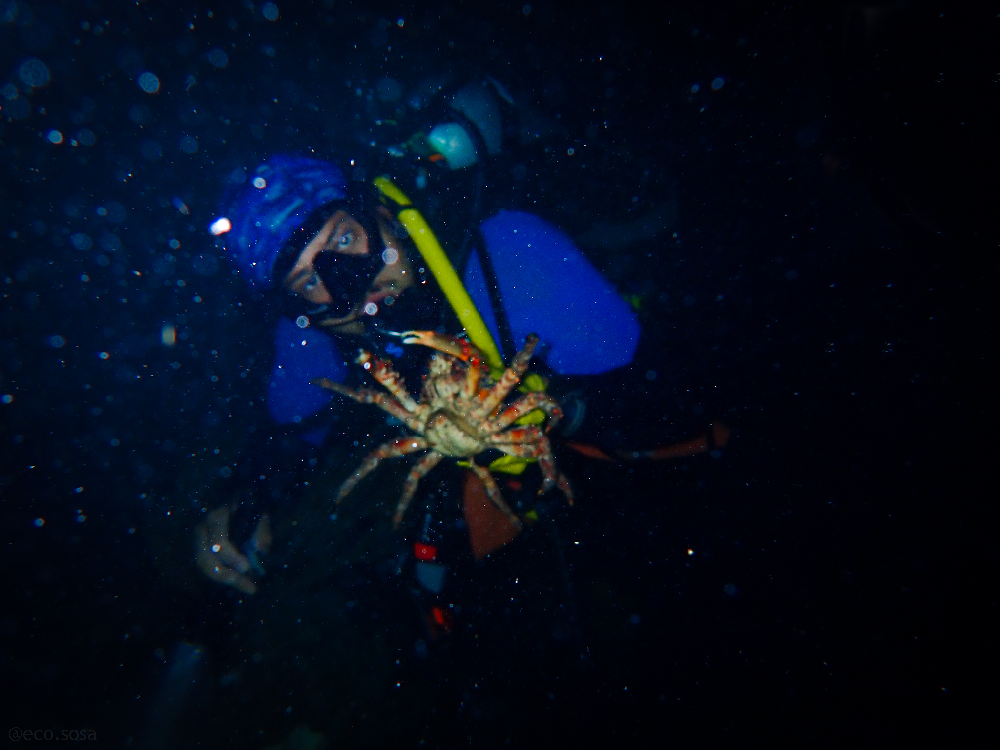

::: {.callout-note icon=false}

# [*Reefs to Wetlands, Ecology to Economics*]{style="font-size: 1.5em;"}

- **Everglades Economic Valuation** — Contributing to comprehensive ecosystem service valuation with The Everglades Foundation
- **Quarry Mariculture Research** — Testing innovative grow-out methods for Caribbean King Crabs to scale up restoration and reduce macroalgae on reefs.
- **Socioeconomic Survey** — Linking community voices to reef restoration outcomes by measuring how Floridians view, value and support grazer stocking and coral outplanting.
- **Reef Futures Leadership** — Leading biotic intervention working group to develop Caribbean-wide recommendations for advanced restoration strategies
:::

---

# Research Portfolio

My work bridges marine ecology, environmental economics, and restoration science to develop practical solutions for coral reef conservation in South Florida and the Caribbean.

{style="width: 100%; max-width: 700px; height: 300px; object-fit: cover; border-radius: 15px; margin: 2em auto; display: block; box-shadow: 0 8px 32px rgba(0,0,0,0.1);"}

***

## Research Themes

### **Marine Restoration Ecology**

**Caribbean Reef Restoration Interventions** | *Biotic Intervention Lead* 
Leading biotic subgroup (grazer stocking, supportive habitat restoration, species removal) developing recommendations for advanced coral restoration strategies across the Caribbean through the Reef Futures Workshop.

**Marine Grazer Research** | *Doctoral Researcher* 
Investigating how Caribbean King Crabs and long-spined sea urchins enhance coral restoration success through dynamic modeling, socioeconomic analysis, and mariculture experiments.

**Coral–Crab Restoration Project** | *Research Assistant* 
Restoring corals alongside stocking crab grazers, while monitoring impacts on reef health metrics such as fish abundance, benthic composition, and coral outplant survival.

### **Environmental Economics**

**Everglades Economic Valuation** | *Research Consultant* 
Contributing to comprehensive economic valuation of the Greater Everglades system, developing benefit-transfer approaches and stakeholder engagement strategies. [View Report](https://b797e412-2757-4f33-af72-a0f87d5b59ea.usrfiles.com/ugd/d45609_d489ae3e21024e3da5e8024227993854.pdf)

**Florida Socioeconomic Reef Survey** | *Doctoral Researcher* 
Designing surveys to understand public perceptions and willingness-to-pay for marine restoration interventions to inform policy and communication strategies.

**Florida Coastal Everglades LTER** | *Collaborative Researcher* 
Investigating the benefit–cost ratio of the Comprehensive Everglades Restoration Plan (CERP), evaluating how large-scale restoration initiatives impact ecosystem services and provide long-term returns for communities and the environment.

### **Toxicology & Fish Biology**

**Fish Toxicant Meta-Analysis** | *Lead Researcher* 
Comprehensive meta-analysis examining bioaccumulation and maternal transfer of mercury and PCBs in freshwater fish, focusing on impacts on offspring survival and growth. (manuscript submitted 9/2025 *Fish and Fisheries*)

***

## Supporting Research Activities

Over the years, I have contribute to collaborative projects across marine science:

**Reef Ecology & Restoration** • **Socioeconomic Surveys** • **Fish Ecology** • **Spiny Lobster Research** • **Marine Sponge Ecology** • **Reef Biogeochemistry** • **Fish Toxicology** • **Mariculture** • **Benefit-Cost Analysis** • **Environmental Economics**

{style="width: 48%; border-radius: 10px; box-shadow: 0 4px 16px rgba(0,0,0,0.1);"}
{style="width: 48%; border-radius: 10px; box-shadow: 0 4px 16px rgba(0,0,0,0.1);"}

---

## Research Impact

My interdisciplinary approach combines ecology with economic analysis and social science methods to develop restoration strategies that are effective and feasible. I aim for this work to contribute to management decisions and policy conversations that guide coral reef conservation in South Florida and the Caribbean.

